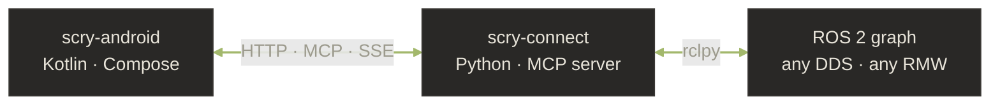

# Architecture

How the pieces fit together. Read in order if you're new; jump if you
already know the shape.

- **[Overview](overview.md)** — phone is the thick client, robot just
  runs an MCP server, no cloud backend. The tiered context system.
- **[UI design](ui-design.md)** — colours, screens, the empty-state
  brand mark, the "trust the renderer" principle.
- **[AI provider strategy](ai-providers.md)** — multi-provider
  abstraction, OpenRouter as primary, Ollama as offline default.
- **[Development phases](development-phases.md)** — what's shipped,
  what's next, the phased roadmap.

## The 30-second summary

| Layer | What it does | Lives on |
|---|---|---|
| **Android app** | UI, AI proxy loop, rich rendering, monitors, fleet view | Phone |
| **scry-connect** | MCP server exposing ROS 2 via ~99 tools, SSE topic streaming | Robot |
| **AI provider** | LLM that picks tools and writes prose | Cloud (or Ollama locally) |

The phone is the **thick client** — all the logic that doesn't need
to be co-located with the robot (AI calls, rich rendering, history)
lives on-device. The robot just runs a thin Python server.

Why this shape: cloud AI APIs can't reach your private WiFi, so the
phone proxies tool calls between the AI and the robot. This also
means **there's no Phaneron-controlled backend in the data path** —
your API keys, your robot's data, your LAN.
