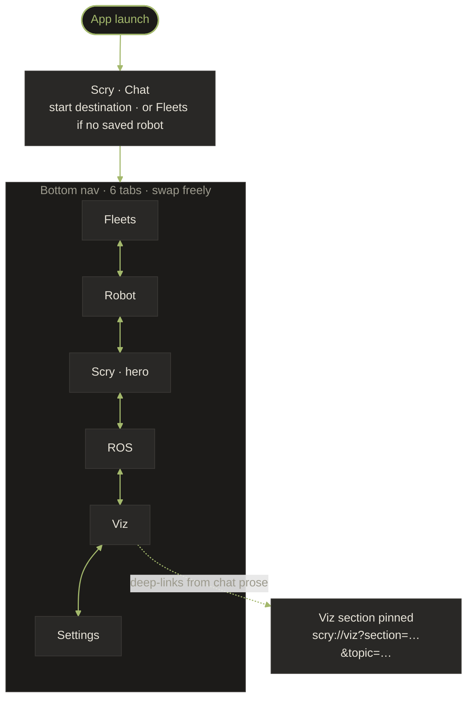

# Scry — UI Design

## Design Philosophy

- **AI-first**: The chat screen is the hero. Everything else supports debugging.
- **Dark-first**: Engineers work in dark environments (labs, server rooms, field at night). Scry is dark-only in v1 — the brand identity is graphite + green and we don't dilute it with a light scheme.
- **Quiet & technical**: Closer to Linear, Vercel, or Foxglove than to a consumer app. Calm surfaces, sparse accents.
- **Simple and focused**: Not a dashboard overload. Clean, functional, minimal.
- **User-friendly**: A new user should be debugging within 2 minutes of opening the app.

## Color Palette

Source of truth: [`scry-brand/BRAND.md`](https://github.com/phaneron-robotics/scry-brand/blob/master/BRAND.md). The brand is dark-first, monochromatic, with a single saturated accent (green). If everything is green, nothing is.

```
Graphite:    #18181B   Icon tile, app background, primary surface
Bar:         #52525B   Logo bars, outlines, dividers, secondary text
Accent:      #22C55E   Primary action, success, the only saturated color
Surface:                Same as graphite (Material 3 `surface`)
SurfaceContainer:     #27272A   Cards, dialogs, raised content
SurfaceContainerHigh: #3F3F46   Modals, elevated app bar
OnSurface:           #FAFAF9   Primary text on dark surfaces
OnSurfaceVariant:    #A1A1AA   Secondary text, captions, hints
Outline:             #52525B   Borders, dividers
Success:             #22C55E   Connected, healthy
Warning:             #F59E0B   Slow topics, throttled, soft errors
Danger:              #EF4444   Disconnected, errors, write-tool denials
Info:                #3B82F6   Neutral system messages, links
```

Token names map 1:1 to Compose values in [`android/app/.../ui/theme/Color.kt`](https://github.com/phaneron-robotics/scry-android/blob/master/app/src/main/java/com/scry/ui/theme/Color.kt) and Android resources in [`android/app/.../res/values/colors.xml`](https://github.com/phaneron-robotics/scry-android/blob/master/app/src/main/res/values/colors.xml).

### Robot Status Colors

```
Connected/Active:  #22C55E  (Success/green)
Warning/Busy:      #F59E0B  (Warning/amber)
Error/Fault:       #EF4444  (Danger/red)
Disconnected:      #A1A1AA  (OnSurfaceVariant/gray)
```

### Typography

- **UI text**: System sans-serif (Roboto on Android). No custom font in v1.
- **Code/data**: `JetBrains Mono` or system mono fallback for topic names, JSON, terminal-style screens.
- **Sentence case throughout** — no Title Case, no ALL CAPS.
- **Two weights only**: 400 (regular) and 500 (medium). Avoid 600/700 — too heavy for a calm, technical brand.

## Screen Flow



**Bottom Navigation Bar** (6 tabs, Scry is the start destination):
1. **Fleets** — saved/discovered robots (DeviceHub icon). Internal route id: `connection`.
2. **Robot** — host system + ROS health for the active robot (SmartToy icon). Internal route id: `dashboard`.
3. **Scry** — AI chat, the primary surface (brand mark icon). Internal route id: `chat`.
4. **ROS** — graph browser hub: topics, nodes, services, actions, lifecycle, params, components, logs, TF, processes (AccountTree icon). Internal route id: `topics`.
5. **Viz** — dedicated visualisation surface with seven sections: scene, camera, BT, geomap, plot, sensors, teleop (Insights icon). Internal route id: `visualization`.
6. **Settings** — credentials and preferences (gear icon).

Route ids are kept as the historical names so existing deep-links and analytics continue to work; only the user-facing labels change.

Visualization is reachable from the Viz tab, from any `scry://viz?section=…&topic=…` link the AI emits in chat prose, or from Topic Detail → "Visualize".

---

## Screen Designs

### 1. Connection Screen

Shown on first launch or when adding a new robot.

```
┌──────────────────────────────────────┐
│                                      │
│          Scry                   │
│    Your robot in your pocket         │
│                                      │
│  ┌──────────────────────────────┐    │
│  │  Robot IP or hostname        │    │
│  │  [ 192.168.1.100           ] │    │
│  └──────────────────────────────┘    │
│                                      │
│  ┌──────────────────────────────┐    │
│  │  Robot name (optional)       │    │
│  │  [ My TurtleBot             ] │    │
│  └──────────────────────────────┘    │
│                                      │
│  Connect port: [ 5339 ]              │
│  Rosbridge:   [ 9090 ] (optional)   │
│                                      │
│  [ Test Connection ]    [ Connect ]  │
│                                      │
│  ─ ─ ─ Saved Robots ─ ─ ─           │
│                                      │
│  ┌──────────────────────────────┐    │
│  │ TurtleBot-1  192.168.1.50 │    │
│  │   Last connected: 2h ago     │    │
│  └──────────────────────────────┘    │
│  ┌──────────────────────────────┐    │
│  │ Lab Robot   192.168.1.51   │    │
│  │   Last connected: 3 days ago │    │
│  └──────────────────────────────┘    │
│                                      │
└──────────────────────────────────────┘
```

### 2. Robot (host system + ROS health)

Sectioned, expandable, **honest**. The page is a data sheet — no
green/amber/red verdicts derived from counts, because a count can't
tell you whether a system is healthy. ROS 2 developers know better
than to trust a "DDS OK" badge based on `nodes > 0`; we don't insult
them.

Sections, in display order. **Identity is open by default**; the rest
are collapsed and tap to expand. The DDS health probe is opt-in (a
button), because it costs 2–5 seconds and shouldn't auto-run.

```
┌──────────────────────────────────────┐
│  TurtleBot-1                    ⟳   │
├──────────────────────────────────────┤
│                                      │
│  ▼ IDENTITY · humble · fastrtps · 0  │
│  ┌──────────────────────────────┐    │
│  │ Hostname        deep-dell    │    │
│  │ LAN IP          192.168.1.42 │    │
│  │ ROS distro      humble       │    │
│  │ RMW             rmw_fastrtps │    │
│  │ Domain ID       0            │    │
│  │ Localhost-only  no           │    │
│  │ Connect          5339  RTT 14 │    │
│  └──────────────────────────────┘    │
│                                      │
│  ▶ GRAPH · 14 nodes · 87 topics · 42 │
│  ▶ LIVENESS · /rosout 2s · /diag 1s  │
│  ▶ DIAGNOSTICS · 12 OK · 2 W · 1 E   │
│  ▶ DDS HEALTH · not measured yet     │
│                                      │
├──────────────────────────────────────┤
│[Fleets][Robot][Scry][ROS][Viz][Set]    │
└──────────────────────────────────────┘
```

**Section contents (when expanded):**

- **Identity** — hostname, LAN IPs, ROS distro, RMW, domain ID, localhost-only flag, connect port + last `/health` round-trip in ms. Every value is a fact; no verdicts. Localhost-only being silently `true` is one of the most common multi-machine bugs and seeing it explicitly here saves hours.
- **Graph** — six counts: nodes, topics, services, actions, lifecycle nodes. Big numbers, no tone. The developer reads them. If lifecycle nodes is 0 on a robot they thought ran Nav2, they spot it themselves.
- **Liveness** — seconds since the last message on `/rosout` and `/diagnostics`, plus the number of statuses in the most recent diagnostics aggregate. Silence is presented as "no message in window", not "broken" — interpretation is left to the developer.
- **Diagnostics** — pill row of `OK / WARN / ERROR / STALE` counts, then any WARN/ERROR rows expanded inline. The pill colours reflect the diagnostics aggregator's own classification (real ROS 2 semantics, not our inference) so colour here is honest.
- **DDS health** — a button: **Run probe**. Tap to fire `ros_doctor_hello` (publisher→subscriber roundtrip on the connect's host), `ros_daemon_status`, and `ros_multicast_receive` for 2 seconds in parallel. Results show as: discovery RTT in ms (or `timeout`), daemon status, datagrams received in the multicast window. These are real measurements, not inferences from counts.

**What's deliberately NOT on this page:**

- No "system healthy" verdict, anywhere.
- No traffic-light tones based on count thresholds.
- No fabricated CPU/RAM/battery widgets — we only show what the robot publishes (e.g. via `/diagnostics`), and we'd label the source if we did.
- No proactive auto-running of the DDS probe — too costly, opt-in only.
- No per-topic Hz strip — topic-of-interest is robot-specific; trying to pick generically would be theatre. Defer to per-robot config.

### 3. Scry — AI Chat (Primary Screen)

The hero screen. Clean chat interface with multi-modal input.

```
┌──────────────────────────────────────┐
│  AI Chat       TurtleBot-1  ▼     │
├──────────────────────────────────────┤
│                                      │
│  ┌──────────────────────────────┐    │
│  │ You                          │    │
│  │ Why is my robot drifting     │    │
│  │ to the left?                 │    │
│  └──────────────────────────────┘    │
│                                      │
│  ┌──────────────────────────────┐    │
│  │ Scry AI                 │    │
│  │                              │    │
│  │ ▸ Reading /cmd_vel (5 msgs)  │    │
│  │   Done — 0.12s            │    │
│  │ ▸ Reading /odom (5 msgs)    │    │
│  │   Done — 0.15s            │    │
│  │ ▸ Inspecting /diff_drive..  │    │
│  │   Done — 0.08s            │    │
│  │ ▸ Getting wheel_radius..    │    │
│  │   Done — 0.05s            │    │
│  │                              │    │
│  │ **Problem**: Left wheel      │    │
│  │ radius is 0.033m but right   │    │
│  │ is 0.035m, causing           │    │
│  │ asymmetric velocity.         │    │
│  │                              │    │
│  │ **Fix**:                     │    │
│  │ ```                          │    │
│  │ ros2 param set               │    │
│  │   /diff_drive_controller     │    │
│  │   left_wheel_radius 0.035   │    │
│  │ ```                          │    │
│  │                              │    │
│  │ [Apply Fix]  [Copy Command]  │    │
│  └──────────────────────────────┘    │
│                                      │
│  ── Write Operation Confirmation ──  │
│  ┌──────────────────────────────┐    │
│  │ AI wants to set parameter:   │    │
│  │ Node: /diff_drive_controller │    │
│  │ Param: left_wheel_radius     │    │
│  │ Value: 0.035                 │    │
│  │                              │    │
│  │   [Deny]         [Approve]   │    │
│  └──────────────────────────────┘    │
│                                      │
├──────────────────────────────────────┤
│ [Mic] [Camera] [Type a message... ▸]│
├──────────────────────────────────────┤
│[Fleets][Robot][Scry][ROS][Viz][Set] │
└──────────────────────────────────────┘
```

**Key UI elements:**
- **Tool call indicators**: Collapsible, show tool name + timing. Green check on success, red X on failure.
- **Confirmation cards**: Inline `ConfirmationCard` for write operations — auto-rendered when the AI announces a write per the `writes` skill. Shows proposed args (with a diff against the current value for `ros_set_parameter`). User must tap Approve before execution.
- **Markdown rendering**: Code blocks, bold, lists, headers in AI responses.
- **Input bar**: Text field + mic button (voice) + camera button (image attachment) + send button.
- **Robot switcher**: The robot-name row in the chat header is tappable — opens a `DropdownMenu` listing every saved robot, with the active one highlighted. Switching swaps `ActiveRobotStore` and rebinds the session.
- **Rich rendering**: tool results auto-render to inline blocks instead of plain JSON (see "Rich chat blocks" below).
- **Monitor strip**: When any background monitor is armed, a `MonitorChipStrip` sits between the header and the message list — one chip per monitor with topic / field / threshold and a cancel button.

#### Rich chat blocks

The chat is not a text log. `RichDispatcher` routes tool results to
inline blocks that re-use the Viz tab's canvases and sensor renderers.
The model's prose adds context and anomaly callouts; the card carries
the data.

| Block | Triggered by | What it shows |
|---|---|---|
| **GroupedList** | `ros_list_topics` / `ros_list_nodes` / `ros_list_services` / `ros_list_processes` | Namespace-grouped list with pub/sub badges; `0 sub` flagged red |
| **Tree** | `ros_tf_frames` | Parent/child tree with per-edge rate badges |
| **EntityCard** | `ros_tf_lookup`, `ros_inspect_node`, `ros_get_parameter`, `ros_describe_parameter` | Per-section chips with translation / rotation / fields |
| **StatusBanner** | `ros_check_health`, `ros_doctor`, `ros_get_diagnostics` | OK / WARN / ERROR banner |
| **Metric** | `ros_topic_hz`, `ros_topic_bw`, `ros_topic_delay` | Big number, tone-coloured by threshold, optional sparkline |
| **LineChart** | `ros_read_topic` (≥2 messages, scalar), `ros_watch_topic` | Multi-series rolling chart, time x-axis |
| **LogViewer** | `ros_get_recent_logs` | Level chips + search + virtualised list |
| **SceneSnapshot** | `ros_read_scene` (composed) or single-layer `ros_read_topic` for `OccupancyGrid` / `Path` / `LaserScan` / pose types | Top-down composed view (map + base_link + scan dots + path + scale bar) |
| **GpsView** | `ros_read_topic` (`NavSatFix`) | OSM map + marker + trail |
| **ImagePreview** | `ros_read_topic` (`Image` / `CompressedImage`) | FeedTile chrome, tap-to-zoom |
| **SensorPanel** | `ros_read_topic` (`Imu`, `BatteryState`, `Range`, `MagneticField`, `Wrench`, `Joy`, scalar sensors) | Same renderer as Viz tab — attitude indicator, voltage / SoC + cells, range cone, field arrow, force/torque bars, sticks/triggers, gauge with threshold bands |
| **BtTreeView** | `ros_bt_get_active_tree` | Full behaviour-tree map inline (auto-fit, kind-coloured nodes, status-coloured borders) |
| **ConfirmationCard** | AI announces a write (`writes` skill) | Proposed args + Approve / Deny |
| **LivePanel** | `render_panel(topic, kind, duration_s, fields?)` | 1–30 s live mini-panel embedded in chat |
| **LiveScene** | `render_scene_live(map_topic?, pose_topic?, scan_topic?, path_topic?, duration_s)` | Composed live scene (parallel SSE per layer, single canvas) |
| **PlanBlock** | `emit_plan(steps, …)` | Multi-step checklist with status glyphs and final verdict |
| **FleetOverview** | `fleet_overview()` | One row per saved robot — online dot, ping ms, summary |
| **RobotComparison** | `compare_robots(left, right, dimension, rows)` | Two-column metric grid with diff-tinted right column |
| **AnomalyOverlay** | (decorator) | Auto-applies on sensor cards — low / critical battery, range out-of-bounds, IMU >3 g, magnetic field outside 10–100 µT, wrench past 50 N / 5 Nm, scalar gauges past `ScalarConfig.spec` |
| **JsonTreeView** | fallback for any unmapped tool result | Collapsible tree |

The presentation rule is captured in `assets/skills/presentation.md`:
**trust the renderer** — the model's prose adds *context, anomaly
callouts, and next steps*, never re-lists what the card already shows.

#### Empty-state suggestion chips

When a chat session is empty, the input area shows three randomly-picked
prompts from `assets/prompts/suggestions.txt` (39 entries). The pool
covers every Phase 2/3 capability — topic listing, scene snapshots, live
panels, monitors, plans, fleet — so a new user discovers what they can
ask for by tapping rather than reading docs.

### 4. ROS — Graph Browser

Browse and inspect the live ROS 2 graph: topics, nodes, services, actions, lifecycle, parameters, components.

```
┌──────────────────────────────────────┐
│  Topics          [Search...]        │
├──────────────────────────────────────┤
│                                      │
│  /camera/compressed                  │
│  sensor_msgs/CompressedImage  1 pub  │
│                                      │
│  /cmd_vel                            │
│  geometry_msgs/Twist    0 pub 1 sub  │
│                                      │
│  /diagnostics                        │
│  diagnostic_msgs/DiagnosticArray     │
│                                      │
│  /imu                          100Hz │
│  sensor_msgs/Imu         1 pub      │
│                                      │
│  /odom                          50Hz │
│  nav_msgs/Odometry       1 pub      │
│                                      │
│  ... (scrollable list)              │
│                                      │
├──────────────────────────────────────┤
│[Fleets][Robot][Scry][ROS][Viz][Set] │
└──────────────────────────────────────┘
```

**Topic Detail View** (tap on a topic):

```
┌──────────────────────────────────────┐
│  ← /odom                            │
├──────────────────────────────────────┤
│                                      │
│  Type: nav_msgs/msg/Odometry         │
│  Rate: ~50 Hz                        │
│  Publishers: 1  Subscribers: 2       │
│                                      │
│  ── Latest Message ──                │
│  {                                   │
│    "header": {                       │
│      "stamp": {"sec": 172384, ...}   │
│    },                                │
│    "pose": {                         │
│      "pose": {                       │
│        "position": {                 │
│          "x": 1.234,                 │
│          "y": 0.567                  │
│        }                             │
│      }                               │
│    }                                 │
│  }                                   │
│                                      │
│  [Visualize]  [Ask Scry]  [Raw/Tree]  │
│                                      │
├──────────────────────────────────────┤
│[Fleets][Robot][Scry][ROS][Viz][Set] │
└──────────────────────────────────────┘
```

### 5. Visualization tab

The Viz tab is the dedicated long-running surface for the same blocks
that render inline in chat. It has seven sections, deep-linkable from
chat prose via `scry://viz?section=<id>&topic=<topic>` (sections:
`scene`, `camera`, `bt`, `geomap`, `plot`, `sensors`, `teleop`).

| Section | Renderer |
|---|---|
| **Scene** | Composed top-down view: occupancy grid + base_link silhouette + scan dots + path overlay + scale bar |
| **Camera** | Live image feed (Image / CompressedImage), with topic chip, dim/format chip, tap-to-zoom |
| **BT** | Interactive behaviour-tree canvas (pan/zoom), kind-coloured nodes, status-coloured borders |
| **GeoMap** | OSM map with NavSatFix marker + trail |
| **Plot** | Multi-series live chart with palette-coloured series, rolling window |
| **Sensors** | Imu, BatteryState, Range, MagneticField, Wrench, Joy, scalar gauges — one renderer per type |
| **Teleop** | Persistent Twist publisher with sticks + safety-clamped envelope |

The Viz tab shares its canvases with the inline chat blocks (one
`SceneCanvas`, one `BtSnapshotCanvas` reused by the chat `BtTreeBlock`,
the same sensor renderers in `ui/visualization/sections/sensors/`). The
two surfaces stay visually identical so what the user sees in chat is
what they get when they tap "Open in Viz".

**Most viz lives in chat now.** Tap a `scry://viz` link in an AI
response to open the section pre-pointed at the right topic; otherwise
the Viz tab is opened directly from the bottom nav. Topic Detail's
"Visualize" button still routes here for ad-hoc inspection.

### 6. Settings

Settings is deliberately narrow: it owns *credentials and config that
never change mid-conversation*. **Provider and model selection live in
the chat top-bar chip** — the chip is the single source of truth, so
you don't have to bounce between screens to swap models.

```
┌──────────────────────────────────────┐
│  Settings                            │
├──────────────────────────────────────┤
│                                      │
│  ── CREDENTIALS ──                   │
│  Anthropic API key       ••••••• >  │
│  OpenAI API key          Not set >  │
│  Google AI API key       Not set >  │
│  Switch providers and models from   │
│  the chip in the chat top bar — this │
│  screen only stores the keys.        │
│                                      │
│  ── OLLAMA (LOCAL) ──                │
│  Base URL    [http://10.0.2.2:11434]│
│  Model name  [qwen2.5:7b]           │
│  Install Ollama → ollama pull ...   │
│                                      │
│  ── DEVELOPER ──                     │
│  Show tiered-context stats [ ○──] │
│  Surface loaded skills/toolsets …   │
│                                      │
│  Scry 0.1.0                          │
│  Keys stored in encrypted shared    │
│  prefs on this device.               │
│                                      │
├──────────────────────────────────────┤
│[Fleets][Robot][Scry][ROS][Viz][Set] │
└──────────────────────────────────────┘
```

Tapping any **API key** row opens a bottom-sheet with a masked input,
a reveal toggle, and a Save button. Keys go straight to encrypted
shared preferences; nothing is logged.

The **Ollama** rows are inline text fields, since the user usually
just types or pastes a host:port and a tag.

The **Developer** section is hidden in plain sight — when on, the
chat screen shows a one-line banner per session listing the loaded
skills, loaded toolsets, and approximate added tokens. Useful while
tuning the tiered-context decision rule; off by default.

Future settings (connection defaults, throttle, clear history) will
land here as additional sections, each with its own `SECTION HEADER`.

---

## Interaction Patterns

### Voice Input
1. User taps mic button → recording starts (button pulses accent green)
2. User speaks → SpeechRecognizer processes
3. Transcription appears in text field → user can edit or send
4. Send → enters AI chat flow

### Image Attachment
1. User taps camera button → choose Camera or Gallery
2. Image captured/selected → thumbnail preview in input bar
3. User types optional text context ("What's wrong in this image?")
4. Send → image + text sent to AI (multi-modal)

### Write Operation Confirmation
1. AI proposes a write action (publish, set param, call service)
2. Inline confirmation card appears in chat with details
3. User taps Approve → action executes, result shown
4. User taps Deny → AI acknowledges, no action taken

### Robot Switching
1. Tap robot name chip in toolbar
2. Bottom sheet shows saved robots with connection status
3. Select different robot → new chat context, reconnects
