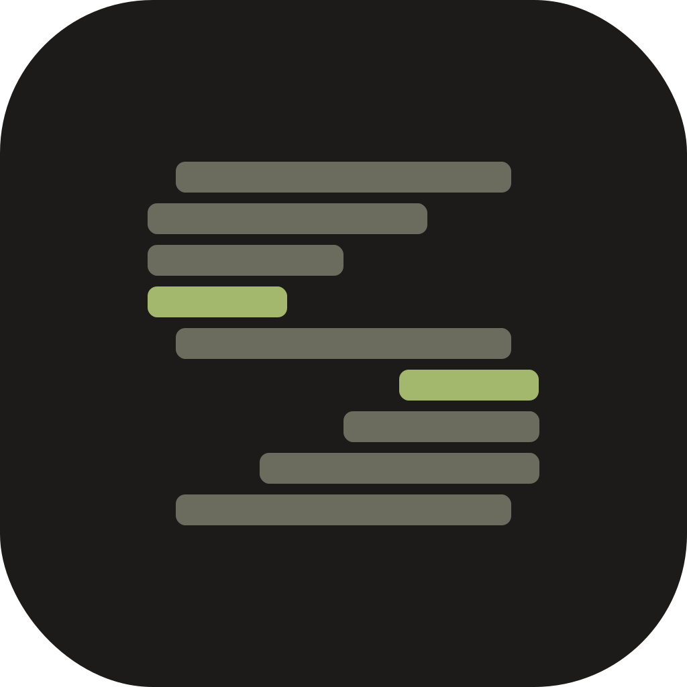

---
hide:
  - navigation
  - toc
title: Scry — AI-first debugging for ROS 2 robots
description: Scry is an open-source Android app that lets you debug any ROS 2 robot through an on-device AI agent. Inspect topics, call services, monitor diagnostics by voice, text, or image, over WiFi, with no cloud backend.
---

<div class="scry-hero" markdown>

<h1 class="scry-hero__title">Scry<span class="scry-hero__title-accent">.</span></h1>
<p class="scry-hero__tagline">
Your ROS 2 robot, in your pocket. Debug topics, call services,
and monitor diagnostics by chatting with an on-device AI agent.
</p>
<div class="scry-hero__actions">
  <a href="get-started/" class="md-button md-button--primary">Get started</a>
  <a href="architecture/" class="md-button">How it works</a>
  <a href="https://github.com/phaneron-robotics/scry-android" class="md-button">View on GitHub</a>
</div>
</div>

<span class="scry-eyebrow">What is Scry</span>

Scry is an Android app and a small Python server that together turn any
ROS 2 robot into something you can talk to. Ask a question in plain
English, by voice, or with a screenshot. The agent introspects your
robot's topics, nodes, services, parameters, and diagnostics live over
WiFi and answers with structured panels, plots, and links to deeper
views.

The phone is the thick client. The robot just exposes its ROS 2 graph as
an MCP server. **No cloud backend. No telemetry. Your AI keys, your
robot, your LAN.**

---

<span class="scry-eyebrow">Where to go next</span>

<div class="grid cards" markdown>

-   **Get started**

    Install the Android app, run `scry-connect` on the robot, pair, ask
    your first question. About fifteen minutes end to end.

    [Get started](get-started/index.md)

-   **Use Scry**

    Chat with the agent, attach logs and images, set background
    threshold monitors, send feedback on every reply.

    [Use Scry](use/index.md)

-   **Architecture**

    Phone is the thick client, robot just runs an MCP server. How the
    tiered context system works. Why there is no cloud backend.

    [Architecture](architecture/index.md)

-   **Reference**

    The ninety-nine MCP tools `scry-connect` exposes, what each one
    returns, which require user approval. App permissions.

    [Reference](reference/index.md)

-   **Operator**

    Run a beta. Cut a release. Audit security. The runbooks Phaneron
    Robotics uses internally.

    [Operator](operator/index.md)

-   **Legal**

    Privacy policy, Play Store Data Safety form, security policy,
    license, and brand usage.

    [Legal](legal/index.md)

</div>

---

<span class="scry-eyebrow">How it works</span>

```mermaid
flowchart LR
    A("Android app
    Kotlin · Compose")
    B("scry-connect
    Python · MCP server")
    C("ROS 2 graph
    any DDS / RMW")
    A <==>|"HTTPS · MCP · SSE"| B
    B <==>|"rclpy"| C
    classDef brand fill:#292826,stroke:#3A3835,stroke-width:1px,color:#E8E4D9;
    class A,B,C brand;
    linkStyle 0,1 stroke:#A3B86C,stroke-width:2px,color:#9C9A8D;
```

The phone runs the AI provider, the tool router, the rich renderer, the
background monitors, and the fleet view. The robot runs a small Python
server (`scry-connect`) that exposes its ROS 2 capabilities as MCP tools.

---

<span class="scry-eyebrow">What you need</span>

- **A phone** running Android 9 (API 28) or newer.
- **A ROS 2 robot** running Humble, Iron, Jazzy, Kilted, or Rolling.
- **An AI provider key.** OpenRouter is recommended because one key
  unlocks more than three hundred models. Direct Claude, OpenAI, or
  Gemini keys also work. For fully offline use, point Scry at a local
  Ollama server.
- **The same WiFi network.** Phone and robot talk directly. Nothing
  routes through the cloud.

---

<span class="scry-eyebrow">Open source</span>

| Component        | Repository                                                                       | License    |
| ---------------- | -------------------------------------------------------------------------------- | ---------- |
| Android app      | [`scry-android`](https://github.com/phaneron-robotics/scry-android)              | Apache 2.0 |
| Robot MCP server | [`scry-connect`](https://github.com/phaneron-robotics/scry-connect)              | Apache 2.0 |
| Docs site        | [`scry-web`](https://github.com/phaneron-robotics/scry-web)                      | Apache 2.0 |
| Brand assets     | [`scry-brand`](https://github.com/phaneron-robotics/scry-brand)                  | CC-BY-4.0  |

Maintained by [Phaneron Robotics, Inc.](https://www.phaneronrobotics.com/)
